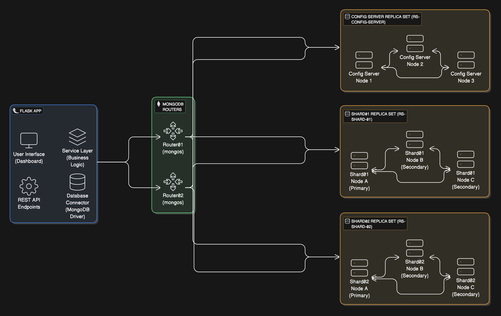

## **1. Présentation du projet**

Ce projet met en œuvre une architecture distribuée pour MongoDB avec sharding et réplication, intégrée avec une application Flask. L'objectif est de créer un système évolutif, performant et tolérant aux pannes. Une interface utilisateur moderne est également incluse pour faciliter l'interaction avec la base de données.

---

## **2. Objectifs**

1. **Sharding MongoDB** pour distribuer les données de manière équilibrée entre plusieurs shards.
2. **Réplication** pour assurer la redondance et la haute disponibilité des données.
3. **Intégration Flask** pour fournir une interface utilisateur et des API REST pour interagir avec MongoDB.
4. Automatisation de l'initialisation du cluster MongoDB et de ses configurations.
5. Création de scripts pour tester le failover et configurer les priorités des membres des replica sets.

---

## **3. Architecture**

### **3.1 Description générale**

L'architecture comprend :

1. **Application Flask** : Fournit l'interface utilisateur (UI) et des API REST.
2. **Routers MongoDB (mongos)** : Acheminent les requêtes des clients vers les shards appropriés.
3. **Config Servers** : Conservent les métadonnées du cluster et gèrent la répartition des données (chunks).
4. **Shards** : Contiennent les données réelles, réparties entre plusieurs noeuds.

---

### **3.2 Diagramme d'architecture**



---

### **3.3 Composants du système**

1. **Application Flask** :

   - Fournit un tableau de bord interactif pour l'utilisateur.
   - Expose des API REST pour les opérations CRUD sur MongoDB.

2. **Routers MongoDB** :

   - Deux routers (`Router01` et `Router02`) pour équilibrer la charge et offrir une haute disponibilité.

3. **Config Server Replica Set** :

   - Trois membres (`configsvr01`, `configsvr02`, `configsvr03`) pour gérer les métadonnées.

4. **Shards avec réplication** :

   - Deux shards (`Shard01`, `Shard02`), chacun configuré avec un replica set (3 nœuds par shard).

5. **Réplication MongoDB** :
   - Assure la redondance et la tolérance aux pannes.
   - Gère automatiquement les basculements (failover).

---

## **4. Déploiement**

### **4.1 Prérequis**

1. Installer **Docker** et **Docker Compose**.
2. Cloner le dépôt du projet :
   ```bash
   git clone https://github.com/Firas-Ruine/flask_mongo_app.git
   cd flask_mongo_app
   ```

### **4.2 Étapes**

1. **Démarrer les conteneurs Docker** :

   ```bash
   docker-compose up --build
   ```

2. **Initialiser le cluster MongoDB** :

   - Exécutez les scripts suivants dans l'ordre :
     ```bash
     bash scripts/init/config_servers.sh
     bash scripts/init/shard_servers.sh
     bash scripts/init/add_shards.sh
     ```

3. **Vérifier l'état du cluster** :
   - Connectez-vous au router :
     ```bash
     docker exec -it router01 mongosh
     ```
   - Vérifiez la configuration :
     ```javascript
     sh.status();
     ```

---

## **5. Fonctionnalités**

### **5.1 MongoDB**

- **Sharding** :
  - Répartition des données entre les shards pour une scalabilité horizontale.
- **Réplication** :
  - Chaque shard et serveur de configuration est un replica set pour assurer la redondance.
- **Failover automatique** :
  - Basculer automatiquement sur un noeud secondaire en cas de panne.

### **5.2 Application Flask**

- **Interface utilisateur** :
  - Tableau de bord interactif avec recherche, tri et pagination.
- **API REST** :
  - Points de terminaison pour insérer et récupérer des données.
- **Surveillance MongoDB** :
  - Vérifier l'état du cluster et tester les basculements.

---

## **6. Scripts**

### **6.1 Scripts d'initialisation**

| Nom                 | Description                                           |
| ------------------- | ----------------------------------------------------- |
| `config_servers.sh` | Configure les config servers en tant que replica set. |
| `shard_servers.sh`  | Configure les shards en tant que replica sets.        |
| `add_shards.sh`     | Ajoute les shards au cluster via les routers.         |

### **6.2 Scripts de réplication**

| Nom                 | Description                                                 |
| ------------------- | ----------------------------------------------------------- |
| `set_priorities.sh` | Configure les priorités des noeuds des replica sets.        |
| `failover_test.sh`  | Simule un basculement (failover) pour tester la redondance. |

### **6.3 Utilitaire**

| Nom                    | Description                                             |
| ---------------------- | ------------------------------------------------------- |
| `exec_in_container.sh` | Exécute des commandes MongoDB dans un conteneur Docker. |

---

## **7. Tester le failover**


1. Exécuter le script de test :

   ```bash
   bash scripts/replication/failover_test.sh
   ```

2. Résultats attendus :
   - Un nouveau noeud primaire est élu automatiquement.
   - Le noeud redémarré rejoint le cluster comme secondaire.


## **8. Conclusion**

Le projet implémente une architecture robuste combinant sharding et réplication MongoDB, intégrée avec une application Flask moderne. Il garantit la scalabilité, la haute disponibilité et offre une interface utilisateur intuitive pour interagir avec le système.
